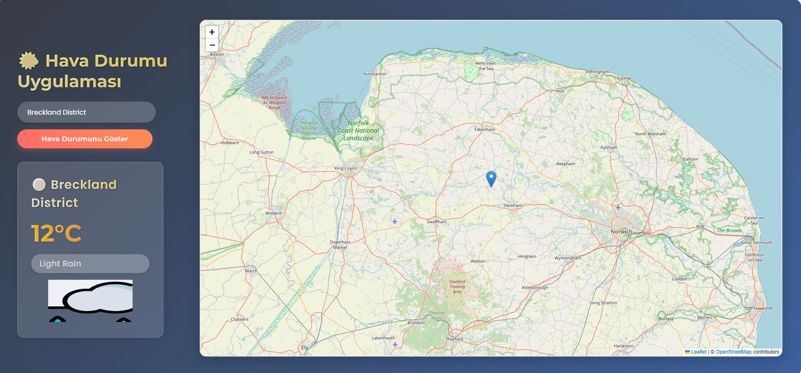

# 🌤️ Weather App - Hava Durumu Uygulaması

Modern ve interaktif bir hava durumu takip uygulaması. Şehir araması yapabilir veya haritadan konum seçerek anlık hava durumu bilgilerini görüntüleyebilirsiniz.



## ✨ Özellikler

- 🔍 Şehir ismi ile arama yapabilme
- 🗺️ Haritadan konum seçebilme
- 🌡️ Anlık sıcaklık bilgisi
- 📍 Detaylı konum bilgisi
- 🎨 Hava durumuna göre dinamik olarak değişen arayüz
- 🖼️ Hava durumuna özel ikonlar
- 📱 Responsive tasarım
- 🌍 OpenStreetMap entegrasyonu

## 🛠️ Kullanılan Teknolojiler

- React.js
- Vite
- OpenWeatherMap API
- Leaflet & React-Leaflet
- CSS3 Animations
- Modern JavaScript (ES6+)

## ⚙️ Kurulum

1. Repoyu klonlayın:
```bash
git clone https://github.com/yourusername/weather-app.git
```

2. Proje dizinine gidin:
```bash
cd weather-app
```

3. Gerekli paketleri yükleyin:
```bash
npm install
```

4. `.env` dosyası oluşturun:
```bash
cp .env.example .env
```

5. `.env` dosyasına OpenWeatherMap API anahtarınızı ekleyin:
```env
VITE_WEATHER_API_KEY=your_api_key_here
```

6. Uygulamayı başlatın:
```bash
npm run dev
```

## 🔑 API Anahtarı Alma

1. [OpenWeatherMap](https://openweathermap.org/) sitesine üye olun
2. API anahtarınızı alın
3. `.env` dosyasına API anahtarınızı ekleyin

## 🎨 Hava Durumu Temaları

Uygulama aşağıdaki hava durumları için özel temalar içerir:

- ☀️ Clear (Açık)
- ☁️ Clouds (Bulutlu)
- 🌧️ Rain (Yağmurlu)
- 🌦️ Drizzle (Çiseleme)
- ⛈️ Thunderstorm (Fırtına)
- 🌨️ Snow (Karlı)
- 🌫️ Mist/Fog/Haze (Sisli)

## 📱 Responsive Tasarım

- Desktop
- Tablet
- Mobile

## 🤝 Katkıda Bulunma

1. Bu repoyu forklayın
2. Yeni bir branch oluşturun (`git checkout -b feature/AmazingFeature`)
3. Değişikliklerinizi commit edin (`git commit -m 'Add some AmazingFeature'`)
4. Branch'inizi push edin (`git push origin feature/AmazingFeature`)
5. Pull Request oluşturun

## 📝 Lisans

Bu proje MIT lisansı altında lisanslanmıştır. Detaylar için [LICENSE](LICENSE) dosyasına bakınız.

## 🙏 Teşekkürler

- OpenWeatherMap API
- OpenStreetMap
- React-Leaflet ekibi
- React Topluluğu

## 🔗 Faydalı Linkler

- [OpenWeatherMap API Docs](https://openweathermap.org/api)
- [React-Leaflet Docs](https://react-leaflet.js.org/)
- [Vite Docs](https://vitejs.dev/)

## 📞 İletişim

Your Name - [@yourusername](https://twitter.com/yourusername)

Project Link: [https://github.com/yourusername/weather-app](https://github.com/yourusername/weather-app)

---
⭐️ Bu projeyi beğendiyseniz yıldız vermeyi unutmayın!
